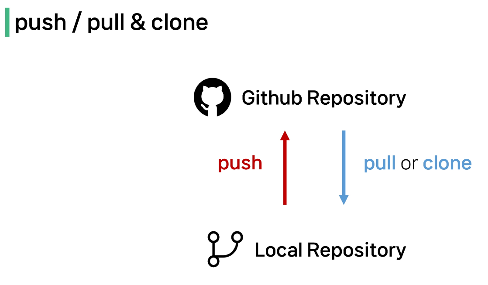

# gitlab

- 나의 주소를 클론 복사하고 새폴더 vscode에 git clone 사이트 주소 붙이면 생성

- 주의사항 : 하나의 repository로 올린거는 하나의 폴더로 받을 수 있다. 즉, 일대일 대응만이 가능하다.

# Github 
- one of the 원격 저장소 서비스s
1. git remote add origin URL => 로컬저장소에 원격 저장소 주소 추가, origin은 추가 원격저장소 별칭임

- git remote -v : 원격 저장소 목록 확인

  
- git push -u origin master : 원격 저장소에 commit 목록을 올림(업로드)
- git pull origin master : 원격 저장소의 변경사항만을 받아옴(업데이트)
- git clone URL: 원격 저장소 전체를 복제(다운로드, 처음 다운할 때)

- gitignore : git에서 특정파일이나 디렉토리를 추적하지 않도록 설정하는 데 사용되는 txt파일(추적을 무시함, 공유하지 않아야 하는 것들에 활용)
ⓐ .gitignore 파일 생성
ⓑ gitignore에 추적원치않는 파일 작성
ⓒ git init, git status

- 팀플 도중 git 병합 충돌 : 서로 수정한 것들을 push 먼저해서 발생. 따라서 pull을 먼저 사용하고 push를 사용 해야한다!
