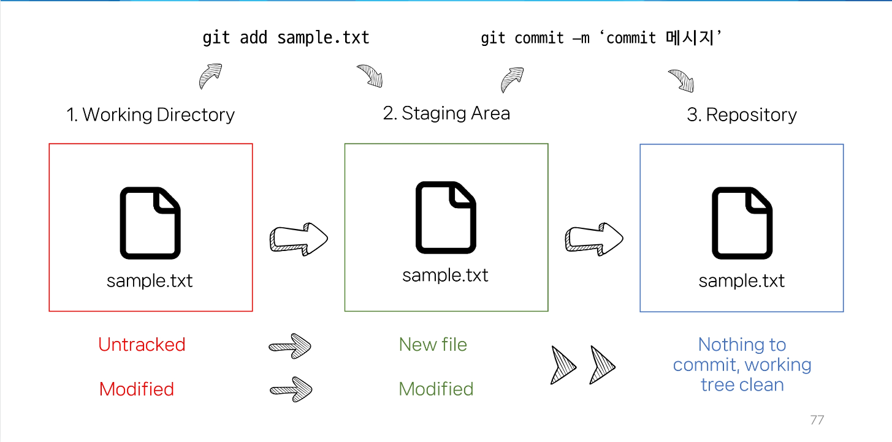

# 승재홍의 TIL
## 2023-07-12 : 고생의 시작
- 반 배정이 된 오늘은 1일 1프로젝트가 아닌 진짜 공부를 배웠다. 점심먹고 터덜터덜 교실으로 돌아가던 중 처음으로 집가고 싶다는 생각이 들었다. 조금 지친거 같아.. 잘 쉬어주고 다시 회복해서 정진하자.. 꿈을 잊진 않았잖아? 파이팅!!

- 주요 내용으로는 마크다운 문법 및 활용, CLI 개념, Git에 대해 배웠고 

### 2. Markdown 공부 내용
- markdown : 주로 개발자들이 텍스트와 코드를 작성해 문서화하기 위해 사용함.

    2-1 링크 & 이미지 불러오기
```python
print("ninano")
```
[google로 들어가기](www.google.com)


    2-2 글씨 문법
**굵게**

*기울임*

~~취소선~~

본문
---
본문

|name|sex|age|job|
|:--:|:--:|:--:|:--:|
|Seung|M|27|student|
|Son|M|32|football|


### 3. Git 공부내용
- Git : 분산 버전 관리 시스템, 코드의 '변경 이력'을 기록하고 '협업'을 원활하게 하는 도구
- Working Directory : 실제 작업 중인 파일들이 위치하는 영역
- Staging Area : working directory에서 변경된 파일 중, 다음 버전에 포함시킬 파일들을 선택적으로 추가하거나 제외할 수 있는 중간 준비 영역
- Repository : **버전(commit)** 이력과 파일들이 영구적으로 저장되는 영역, 모든 **버전(commit)**과 변경 이력이 기록됨.
- Commit : 버전, 변경된 파일들을 저장하는 행위, 마치 사진을 찍듯이 기록한다함.



# gitlab

- 나의 주소를 클론 복사하고 새폴더 vscode에 git clone 사이트 주소 붙이면 생성

- 주의사항 : 하나의 repository로 올린거는 하나의 폴더로 받을 수 있다. 즉, 일대일 대응만이 가능하다.


# Github 
- one of the 원격 저장소 서비스s
1. git remote add origin URL => 로컬저장소에 원격 저장소 주소 추가, origin은 추가 원격저장소 별칭임

- git remote -v : 원격 저장소 목록 확인

  
- git push -u origin master : 원격 저장소에 commit 목록을 올림(업로드)
- git pull origin master : 원격 저장소의 변경사항만을 받아옴(업데이트)
- git clone URL: 원격 저장소 전체를 복제(다운로드, 처음 다운할 때)

- gitignore : git에서 특정파일이나 디렉토리를 추적하지 않도록 설정하는 데 사용되는 txt파일(추적을 무시함, 공유하지 않아야 하는 것들에 활용)
ⓐ .gitignore 파일 생성
ⓑ gitignore에 추적원치않는 파일 작성
ⓒ git init, git status

- 팀플 도중 git 병합 충돌 : 서로 수정한 것들을 push 먼저해서 발생. 따라서 pull을 먼저 사용하고 push를 사용 해야한다!
