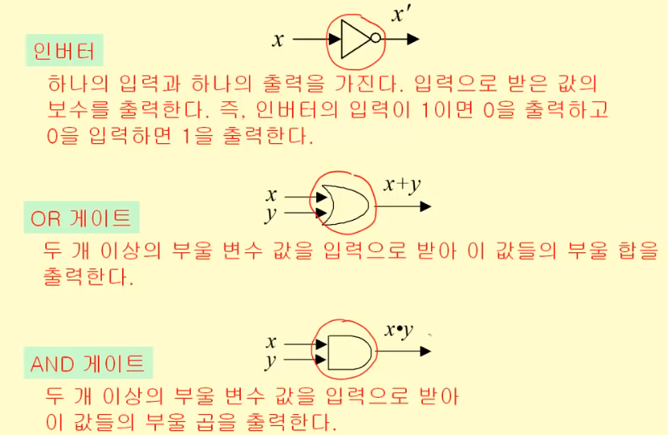

# 부울대수와 논리회로 설계

논리회로설계 문제

입력값 출력값 정의 -> 부울 함수 -> 부울식 -> 부울식 최소화 -> 논리 회로

### 1. 부울 대수(Boolean algebra)

1. 부울 대수 정의

- 집합 S={0,1}에 대해 다음의 3가지 연산(operations)이 존재한다.

- 보수(complement)
  - 보충해주는 수
  - 어떤 수 a에 대한 n의 보수는 a와의 합이 n이 되는 수(예시 : 2에 대한 10 보수는 8)
  - '로 표시(프라임)
  - 원소 0에 대하여 0' = 1, 원소 1에 대하여 1' = 0
- 부울 합(boolean sum)
  - '+' (또는 OR)로 표시
- 부울 곱(boolean product)
  - '\*' (또는 AND)로 표시
- 연산 우선순서 : 보수 > 곱 > 합

- 부울 변수(Boolean variable) : 집합 S={0,1}의 원소 값만을 갖는 변수
- 부울 함수(Boolean function) : 0 또는 1의 입력값들에 대하여 0 또는 1의 출력값을 갖는 함수
- 차수 n의 부울 함수(Boolean function) : 변수가 n개로 이루어졌을 때, 차수 n에 오게될 함수

2. 부울 식(Boolean expression)
   

- 부울식이 각각 보수, 곱, 합으로 이루어지면 그것도 부울식이다.
- 부울식의 부울 변수에 0,1을 대입하면 부울 함수 값을 얻을 수 있다.
  <진리표>
  

3. 항등(equivalence, =)

- 부울함수가 모든 입력값에 대해 함수값이 서로 같다면 항등하다고 한다.
  

4. 부울 대수의 법칙

- 위의 정의들을 기초로 이러한 식들이 성립한다.

- 부울대수 법칙 혹은 새로운 명제를 진리표를 이용하여 증명할 수 있다.

- 연역법 증명과정 : 정의(약속) -> 이미 증명된 명제(규칙) -> 새로운 명제(정리)

5. 쌍대성의 원리(duality principle)
   

- 부울 대수의 쌍대는 곱(\*)와 덧셈(+)을 교환하고, 0과 1을 교환하여 구한다.
- 예시 :
  - x(x+y) = x -> x + x\*y = x
  - xz' + x0 -> (x+z') \* (x+0)

### 2. 부울 함수의 표현

- 부울 함수값이 주어졌을 때(입력과 출력이 주어졌을 때), 이 함수를 부울식으로 표현할 수 있다.

1. 최소항
   

   - x1, x2, x3이 주어졌을 때, 최소항은 y1, y2, y3로 나타날 수 있음
   - x1 _ x2 _ x3 => 최소항
   - x1' _ x2 _ x3
   - x1 _ x2' _ x3
   - ....
   - x1' _ x2' _ x3'

2. 논리합 형식 : 곱들의 합

- 부울 함수를 최소항들의 부울 합으로 나타내는 형식

- 부울 함수의 부울식은 **함수의 값이 1**이 되는 **변수값의 조합**들에 대하여 최소항들을 구하고 **그 최소항들의 부울 합(논리합 형식)**을 취하면 구할 수 있다.

- 입력값(x)와 출력값(y)이 주어질 때, 함수의 값이 1이 되도록 하는 최소항을 구해(xy, x'y, x'y')
- 최소항들의 부울합이 부울 함수(부울식)

### 3. 부울식의 최소화

- 다음 2개의 부울식은 항등 관계이다.
- 가장 단순한 부울식으로 나타내는 것이 부울식의 최소화이다.(효율적)

1. 예시 : 변수 2개

  1. 변수들의 최소항을 표현할 수 있는 표를 만들자 !

      

  2. 부울식의 최소화
      - 변수 중에서 공통된 변수 하나만으로 나타낼 수 있음

      
      - y = xy + x'y
      - x' = x'y + x'y'

      
      - xy + xy' = y
      - xy' + x'y + x'y' = x'+y'

2. 예시 : 3 개의 변수를 가진 카르노맵

3. 예시 : 4 개 변수를 가진 카르노맵

4. 정리

 

### 4. 논리회로 설계

1. 게이트와 부울연산

- 논리회로를 부울함수를 통해 설계할 수 있고, 부울함수를 논리회로를 통해 설계할 수 있음.

2. 부울식과 논리 회로

- 부울식은 논리 회로로 표현할 수 있다.
  
  

3. 논리 회로 설계

- 문제 -> 입력과 출력 정의, 부울 함수 -> 부울식(논리식) -> 논리 회로

- 이 과정에서 문제를 보면 논리 회로를 설계할 수 있다.

- 0~9까지 값을 이진수로 표현하기 위해서는 4비트만 있으면 됨

