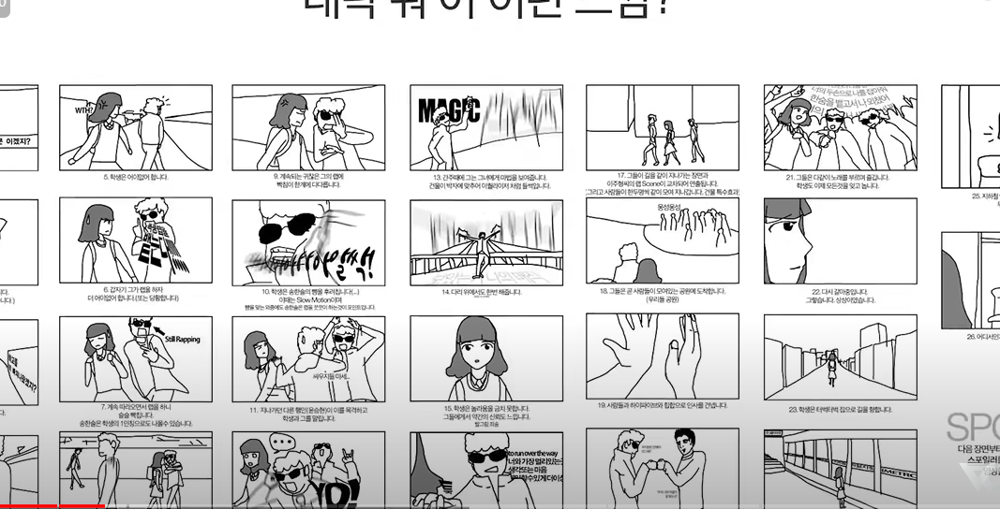

## UCC 제작과정

1. 시나리오(기획안) 작성

    - 시나리오 : 전체적인 진행 및 스토리를 **글**로 구성한 것.

2. 콘티 작성 : 기획안을 바탕으로 영상 설계

    - 콘티 : 영상 제작 시 **각본을 바탕**으로 필요한 모든 사항을 기록한 일종의 기획서.
    - 스토리보드 : 

3. 촬영 : 콘티를 바탕으로 촬영

4. 녹음 : 나레이션, 대사 녹음 진행, TTS 요청가능

5. 편집 : 모바비

## UCC에 들어가야하는 내용

- 대놓고 강조보다는 은연중에 드러나는 느낌?

1. 인트로

2. 기획배경(왜 필요한지? => 이 서비스로 어떻게 해결할건지? / 방법? : 인터뷰)

3. 서비스 소개(주요 기능 설명, 방법? : 스토리?, 기존 서비스와 차별점, 밈 활용 등등 )

4. 마무리

## UCC 참고 영상

- 인천예고 축제(너의 이름은 패러디) : https://www.youtube.com/watch?v=Y13kLU0YXI4
- 꽃바다(꽃보다남자 패러디) : https://www.youtube.com/watch?v=zky1e_cJ9jg
- 위피 광고1 : https://youtu.be/fheyMyy3iyE?si=2spYsh0J0Mx2YNJ8
- 위피 광고2 : https://www.youtube.com/watch?v=pR6GCHsKiCw
- 아바타 미팅(우리와 정말 흡사유사) : https://www.youtube.com/watch?v=ngQkkMlmzA8
- 하트시그널 광고 : https://www.youtube.com/watch?v=XoK5SlIL7ws
- 환승연애 광고 : https://www.youtube.com/watch?v=3S1asSWEqpM

## 최종 발표 개요(15분)

- 쇼처럼 진행 !
- 정말 활기찬 느낌 / 밝은 느낌으로 발표하기 !!

1. 시작 멘트
2. 기획 배경 : 짧게, 이전 내용 상기시키는 정도?
    
    2. 서비스 소개 : UCC?

3. 기능 설명 : 미리 제작된 영상 대체
    - 메인 페이지 설명?
    - 결제
    - 매칭 알고리즘

4. 시연(bgm 넣기?)
    - 메인컨텐츠(3~4단계)를 시연
    - 미팅 지원자 미리 섭외하고 회원가입 로그인 결제시키고 시연시작할때 3단계 중반이어야함,
    - 화면 띄우는 사람은 팀원 중 한명으로 앞에 나와서 발표 ppt와 미팅 구현
    - 얼굴 공개 이후 돌발행동하셈 ! => 신고기능 설명
    - 시연과정이 얼마나 매끄럽게 진행되느냐가 중요함(화면에서.. 딜레이 등)
    - 커플 탄생 이후 메인페이지, 1:1 채팅, 1:1 화상 기능까지?

5. 적용 기술 : 신고 / 매칭 알고리즘

6. 아키텍처 : 그대로

7. 고도화 방안 : AI 신고 차단기능 / 딥페이크 탐지 / AI 얼굴 인식 캐릭터 / 혹은 미리 시연하면서 불편했던 것들

8. 클로징 멘트

## bgm
- RADWIMPS - Nandemonaiya(너의 이름은 OST)
- Sparkle
- 투표 시 브금 : Sometimes Love : https://www.youtube.com/watch?v=mNVpXEe4w24
- 투표 시 브금 : could i love you : https://www.youtube.com/watch?v=kDtPq7aWyEk

## 중간 발표 피드백

- 전체 발표 중 첫번째로 진행하면서 부담감이 많았을텐데 하느라 수고 많으셨습니다. 발표시간은 7분 54초 걸렸습니다. 시간을 적게 사용함으로써 보여주고자 한 것에서 못 보여준 건 없는지 확인해보시고 앞으로는 주어진 시간을 모두 활용해 준비한걸 다 보여주면 좋겠습니다.

- 사람들의 호응을 이끌기 위해 노력하신 모습이 보였습니다. 다만, 첫번째 순서라 분위기가 다소 굳어 있어 호응을 이끌기 어려웠던 것 같습니다. 사람들의 흥미를 이끌기 좋은 주제이니 조금 더 청중과 상호작용하며 진행하면 좋을 것 같습니다.

- 발표자의 목소리도 전반적으로 차분하게 잘 진행된 것 같습니다. 다만, 일정한 톤이다 보니 듣는 사람에 따라 피로도가 있을 수도 있을것 같습니다. 강약 조절이나 속도 조절을 통해 흐름을 조절해 보는 연습을 하시면 도움될 것 같습니다.

- 장표를 넘기면서 다음 내용으로 넘어갈 때 연결이 조금 끊긴다는 느낌을 받았습니다. 브릿지 멘트를 미리 준비하시면 더 좋을 것 같습니다.
PPT의 장표가 다소 비어보이고, 시각적인 변화가 적어 설명 전에 장표를 다 읽고, 발표 내용을 미리 알 수 있어 집중력을 잃기 쉬웠습니다. 다음 발표에서는 한 장표에 여러 내용이 있을 때 이를 분리하거나 애니메이션을 적용하면 좋을 것 같습니다.

- 기술부분 설명에 있어 말로 설명하실 때 “KMP 알고리즘을 이용해서 ~” 보다는 “문자열 검색 알고리즘인 KMP 알고리즘을 이용해서 ~”와 같이 가볍게 무슨 내용인지 말한다면 청중의 이해도를 더 높일 수 있을 것이라고 생각합니다.

