## 1. 블록체인 기본 개념

#### 1. 블록체인 개요

0. 블록체인의 탄생

    - 거래 방식의 발전
        - 물물교환 => 서로 원하는 것을 갖고 있어야만 물물교환 성립(물물교환 단점)
        - 화폐(금, 종이, 디지털)를 이용한 교환 => 가치 측정, 교환의 매개, 가치 저장, 지급 수단
        - 은행 => 개인과 기업에게 신뢰를 통해 화폐 보관
        - 은행의 신뢰(보안)문제
            - 거래 내역 및 장부를 한 장소에 보관
            - 신뢰있는 거래 관리 장부 : 거래 관리, 위변조 방지, 최신 정보
        - 블록체인 기반 암호화폐 발표 : 2008년 금융위기로 중앙은행의 화폐에 대한 신뢰 지적

    - 은행의 정보보안 문제
        - 송금 : 은행은 나는 누가, 언제, 누구에게 얼마를 보냈는지, 거래 내역은 어떤지, 계좌에는 얼마가 있는지 다 알 수 있음
        - 신용카드 거래 : 은행은 사람들이 언제, 어디에서, 무엇을 샀는지, 어디를 갔는지 다 알 수 있음
        - 이렇듯 은행을 해킹하면 거래내역이나 개인정보에 대해 다 알게될 수 있음.

1. 블록체인의 등장 : 비트코인

    - 사이버펑크 운동 : 정부, 거대 기업으로부터 개인의 권리와 자산을 지키기 위한 운동

    - 비트코인의 탄생

        - CyberPunk 운동의 결과물로 화폐 권력의 중앙화를 없애기 위해 사토시 나카모토가 개발
        - 발행기관, 운영기관, 중개기관이 없이 인터넷 상에서 다수의 사람들에게 신뢰받는 세계 최초의 탈중앙형 화폐 탄생

    - 비트코인 특징 

        - 최초의 신뢰성 있는, 그리고 전적으로 개인 간 P2P 거래로만 이루어지는 분산 전자 현금 시스템이다. 
        - 소유권과 신원(identity) 확립을 위한 암호화
        - 이중 지급 방지를 위한 거래 확인 및 네트워크 보안을 담당하는 작업 증명 합의 메커니즘
        - 투명한 공유 원장(블록체인)
        - 익명성

2. 블록체인 2.0 : 이더리움

    - 비탈릭 부테린은 비트코인을 확장하고자 제안하였으나, 당시 급진적인 제안으로 인해 새로운 블록체인, 이더리움(Ethereum)을 개발하게 됨.

    - 이더리움은 업계 최초 ICO를 통해 개발비 모금

    - 이더리움 목표 : DApp(탈중앙화된 응용 프로그램)이라는 분산 응용 프로그램을 구축하고 실행하는 데 필요한 내장 도구들과 화폐 수단들을 개발자들에게 제공함으로써 DApp 개발을 촉진, 확산하는 것이다.  

    - 이더리움은 스마트 컨트랙트를 실행하는 탈중앙화된 컴퓨팅 인프라로 월드 컴퓨터라고도 불림

    - 블록체인에 스마트 컨트랙트 도입하여 DAO(Decentralized Autonomous Organization), 자기주권신원증명(DID), 탈중앙형 금융(Defi) 등의 가능성을 보여주고 Web3.0의 기틀을 마련했다는 평가를 받음.

    - 참고자료

        - github.com/ethereum/wiki/wiki/White-Paper
        - ethereum.github.io/yellowpaper/paper.pdf 

3. 블록체인의 정의

    - **P2P(peer to peer) 네트워크**를 통해 관리되는 분산 데이터베이스의 한 형태로, 블록체인 노드(네트워크에 연결된 여러 컴퓨터)에 **디지털 서명된 거래 정보**를 보관하는 **분산 원장 기술(distributed ledger technology)**

    - 블록체인은 시간이 지남에 따라 점점 커지는 추가 전용 거래 정보 데이터베이스로, 저장된 거래 정보의 손상을 방지하기 위한 암복호화 수단들을 갖추고 있다. 

4. 블록체인 용어

    1. 블록 
        
        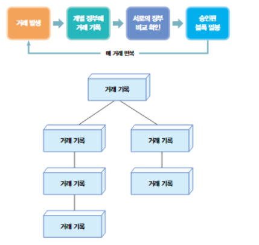
        
        - 블록은 저장 공간으로, 거래 참여자 개인의 컴퓨터에 똑같이 배분됨
        - 거래가 발생하면 거래가 각자의 장부에 기록되고 서로의 장부를 확인한다
        - 거래에 문제가 없다는 것이 확인되면 블록이 밀봉되고 이 과정이 매 거래마다 반복되면서 블록이 쌓인다.

    2. 해시

        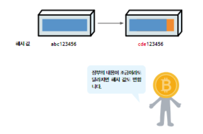

        - 각 블록에는 고유의 해시 값이 주어짐
        - 만약 블록의 내용이 단 하나라도 바뀐다면 해시 값이 바뀌면서 전혀 다른 블록이 됨
        
    3. 체인

        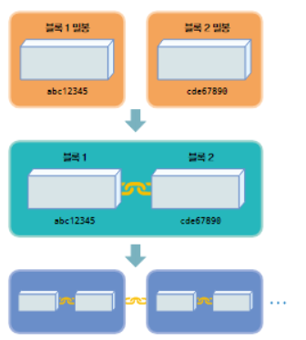

        - 어떤 블록에 해시 값이 정해지고 밀봉되면 다음 거래 장부가 작성된다.
        - 다음 거래 장부에는 그 거래 장부에 대한 해시값이 새롭게 부여됨.
        - 이때 앞 블록이 시간의 순서대로 연결됨

    4. 과반수의 법칙

        - 참여자들 중에서 과반수 이상이 갖고 있는 블록을 옳은 내용이라고 판단함.
        
        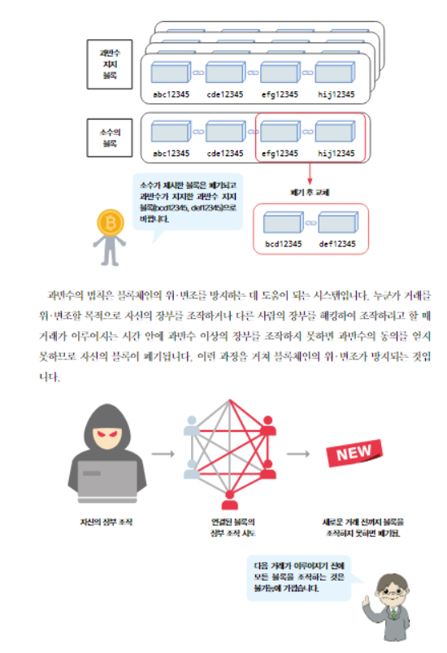

    5. 탈중앙화
        
        - 중앙 집권화에서 벗어나 개인에게 권리와 권력을 나누어 주는 것 

5. 블록체인 특징

    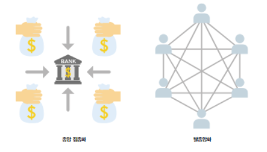

    - 데이터의 투명성, 불변성, 신뢰성, 보안성 => 

    - **탈중앙화, 분산화 기반의 신뢰 시스템인 "공공 거래 장부"** => 

    - 블록체인은 모든 정보가 어느 한 곳으로 밀집되지 않습니다. 정보가 가급적 많은 사람들에게 공유될수록 신뢰도가 높아짐에 의의를 둠
    - 블록체인은 인터넷을 통해서 가치, 즉 실제 자산을 신뢰성 있게 전송하는 채널을 제공할 수 있음
    - 블록체인은 정보의 인터넷에서 가치의 인터넷으로 넘어가는, 그럼으로써 금융부문을 탈중앙화하는 것을 넘어서서 기술의 모든 분야를 재정의하며 P2P 세상을 가능하게 한다.
    - 원장이라는 데이터 베이스는 네트워크에 의해 검증된 금융 거래 정보를 수집, 기록한다.
    - 이 네트워크는 블록의 암호학적 해시 값을 통해 사슬(체인)처럼 연결된 형태이다.
    - 네트워크의 합의 메커니즘으로 검증된 블록만 기존의 '블록들의 사슬'에 추가 되며, 결과적으로 자료의 무결성이 보장된다. 
    

6. 블록체인의 동작 원리

    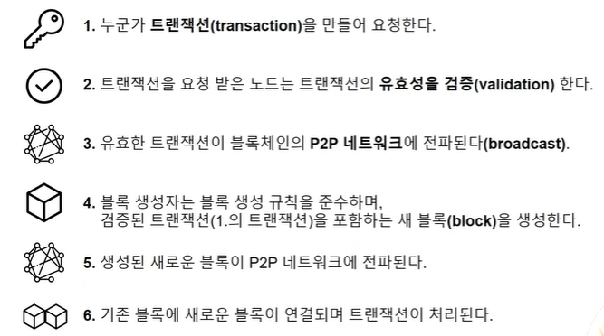

    - 트랜잭션
        - 비트코인 : "누가 누구에게 몇 bit를 보냈다"라는 데이터 /
        - 스마트 컨트랙트 : "소스코드 혹은 소스코드를 실행하는 명령어"

7. 스마트 컨트랙트

    - 스마트 컨트랙트는 블록체인 자체에 저장된, 스스로 실행되는 스크립트
    - 즉, 업무 논리를 불가침의 계약 조항들로 번역해서 중개인이나 변호사, 기타 중간 매개체에 의존하지 않고 스스로 실행되게 만든다.

#### 2. 블록체인의 암호학

1. 공개키 암호화(Public Key Cryptography, PKC)

    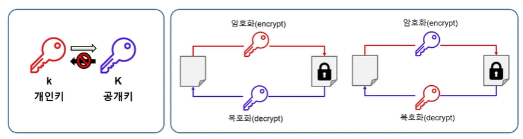

    - 공개키 암호화 === 비대칭 암호화

    - 계산하기는 쉽지만 그 역을 계산하기 어려운 특수한 함수를 바탕으로 생성된 고유한 키를 사용하여 정보를 보호하는 방법

    - 비트코인 및 이더리움에서는 이산 로그 문제를 이용하는 타원곡선암호화를 활용

2. 개인키와 공개키

    1. 개인키 
        - 1 ~ 2^256 사이의 무작위로 선택한 숫자
        - 개인키 생성 프로세스는 오프라인 프로세스

    2. 공개키

        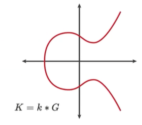

        - 타원 곡선에 있는 점(타원 곡선 방정식을 만족하는 x와 y좌표의 집합)
        - k : 개인키, G : 생성자 점, K : 공개키
        - secp256k1 : 그래프 상의 점G(1 ~ 2^256)를 여러차례 연산을 개인키 만큼 반복하면 도착하는 점이 **공개키**임, 곡선 상에 갖는 하나의 좌표가 큐가 되고, 그 큐가 공개키가 된다. 

3. 해시 함수

    - 공개키를 주소로 변환하기 위해 해시 함수 사용

    - 임의 크기의 데이터를 고정된 크기 데이터로 매핑하는 함수

    - 해시 함수의 입력을 메시지 또는 입력 데이터, 결과를 해시(hash)라고 함.

    - 결과 값을 알고 있을 때, 입력 데이터를 다시 작성하는 것이 불가능한 단방향(one-way)함수

    - 이더리움에서는 keccak-256 함수를 사용 => 빈칸 입력시 code4 리턴 

    1. 공개키를 통해 이더리움 주소 생성
        
        - 공개키를 keccak-256 함수의 입력 값으로 넣으면 256바이트의 출력함.
        - 256바이트 중 뒤에 20바이트만 꺼내고 앞에 0x만 붙이면 됨. 
        - 16진수의 대소문자를 수정하여 이더리움의 이전 버전과 호환되는 체크섬 주소를 사용
        - 그럼 이더리움 주소를 받게 됨.

4. 정리

    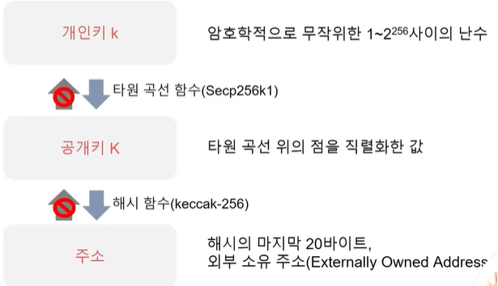

#### 3. 트랜잭션

- 외부 소유 계정(EOA)에 의해 서명된 메시지(외부 소유 계정 : 이더리움 지갑주소)

- 이더리움 네트워크에 전송되고 블록체인에 기록된다.

- 트랜잭션은 블록체인 상태 변경을 유발하거나 컨트랙트를 실행하는 유일한 방법이다.

    - 이더리움은 독자적으로 상태가 변경되지 않는다.

    - 컨트랙트는 독자적으로 실행되지 않는다. 

1. 트랜잭션의 구조

    

    1. 논스 : 해당 주소에서 생성한 트랜잭션의 건수

        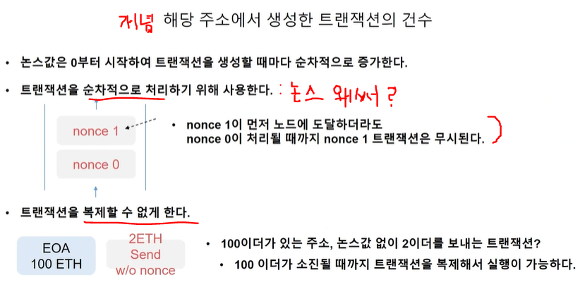

    2. 가스 : 이더리움 네트워크를 사용하기 위한 수수료

        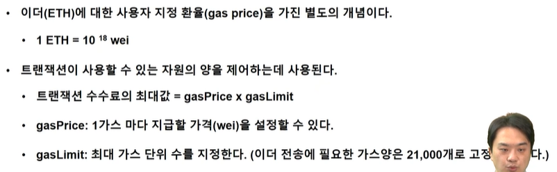
    
    3. 값과 데이터 : 트랜잭선의 주요 페이로드

        

    4. 디지털 서명 : 트랜잭션 정보를 개인키를 사용하여 서명

        

2. 트랜잭션 전파와 기록

    

#### 4. 합의

- 컴퓨터 과학에서 합의는 분산 시스템에서 상태를 동기화하기 위해 사용

- **탈중앙화되었지만, 결정론적으로 운영하기 위해 각자 지켜야하는 규칙(다수결을 찾는 과정)**

- **누가 생성한 블록이 유효한지 합의하기 위한 프로토콜**

- 작업 증명(PoW)과 지분 증명(PoS)이 가장 일반적이다. 

1. 작업 증명(PoW)

    - 임의의(랜덤) 값을 대입하여 얻은 결과 값이 목표 값 이하의 값을 도출할 때까지 해시를 반복하는 작업 => 목표 이하의 값이 나오면 내 블록이 승인

        - 전세계 많은 사람들이 블록을 생성함. 모두가 내 블록이 옳소라고 주장함. 하지만 유효성을 통과한 블록 중에 어떤 하나의 랜덤한 블록을 선택해야함. 랜덤한 값으로 선택되면 작업 증명의 결과 값으로 채굴함. 

    - **해시 함수의 특성에 따라 역산 불가능**하여 **무작위로 대입하는 작업을 무수히 반복**해야한다.

    - 마이닝(채굴)은 새로운 블록을 만들기 위한 작업을 의미하는 것이며, 많은 참가자가 참여할 수록 블록체인의 보안이 강화된다.

    - 마이닝을 통해 새로 발행된 화폐의 보상은 블록체인 시스템 보안에 기여하는 노드에 대한 인센티브이다.

2. 지분 증명(PoS)

    - 금전적 보증금 예치(financial staking) 기반의 알고리즘
        
        - 블록 검증 커뮤니티에 들어가기 위해 이만큼 보증금(담보)을 낼테니 나도 그 커뮤니티에 끼어줘. 보증금을 낸 사람들의 모임 안에서 누가 더 많은 사람들로부터 지지를 받는 블록인지 투표를 진행해서 많은 사람들의 지지를 받은 블록이 채택되는 것을 의미한다.

        - 이더리움 전체 지분의 얼마만큼의 나의 지분이 있어서 커뮤니티에 참여한다. 그래서 지분증명이다. 

        - 블록을 만들고자 하면 검증인 사이에서 투표를 진행하고 다수의 승인을 받게되면 블록이 생성된다.

        - 만약 생성한 블록이 공격의 여지가 있거나 불법의 여지가 있는 등 프로토콜 상의 문제가 발견되면 검증에서 탈락하게되고 보증금을 잃을 위험이 있다. 그래서 참여한 대다수의 사람들은 정직하게 움직일 수 밖에 없다.  

        - 따라서 지분증명은 담보(보증금)를 지키기 위해 정직할 수 밖에 없는 메커니즘이다.    

    - 지분증명 블록체인은 검증인(validator)집합을 유지한다.

    - 이더를 보유한 사람은 이더를 컨트랙트에 예치시키는 특별한 컨트랙트를 보냄으로써 검증인이 된다.

    - 검증인은 다음 블록에 대해 제안하고 투표하는 순서를 따른다.

        - 검증인이 보유한 블록이 대다수의 검증인에 의해 거부되면 보증금을 잃을 위험이 있다.

        - 대다수가 블록을 수락하면 누적된 지분에 비례해 보상을 얻는다.

## 2. 이더리움 스마트 컨트랙트 배포와 호출

#### 1. Smart Contract란?

- 디지털 형식으로 명시된 서약(commitment)들의 집합

1. 스마트 컨트랙트 개념

- 블록체인에서의 정의 : 불변의 컴퓨터 프로그램

    - 불변(immutable) : 한번 배포되면 변경 불가
    - 결정적(deterministic) : 실행한 결과가 모두 같음 ex) 3+4 = 7
    - Ethereum virtual machine(EVM) 위에서 동작
    - 탈중앙화된 world computer 동일한 상태를 유지
    - 스마트 컨트랙트 작성 언어 : **Solidity**, LLL, Viper, Assembly

2. **Smart Contract 배포와 호출**

    

    - Bytecode : 내가 작성한 코드가 컴파일된 코드

    - ABI : 나의 컨트랙트 안에 정의된 함수리스트

    - CA : 배포되면 ID로 쓰게될 주소